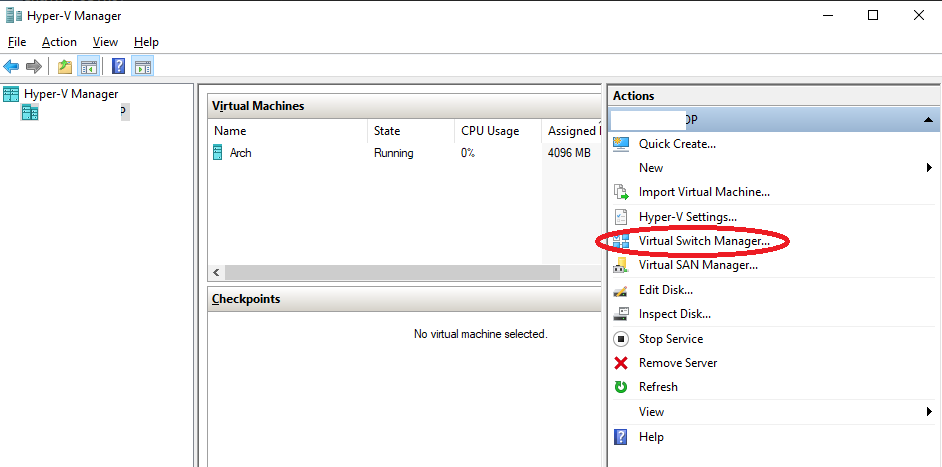
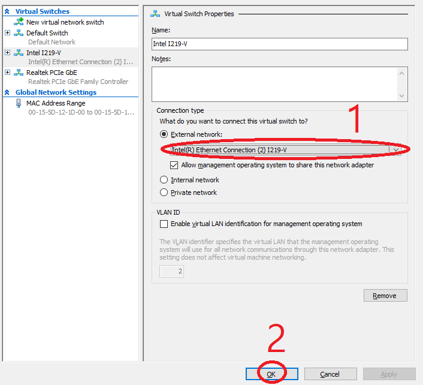
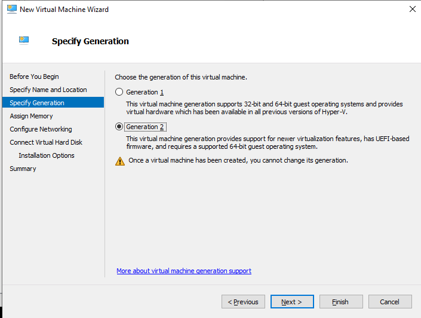
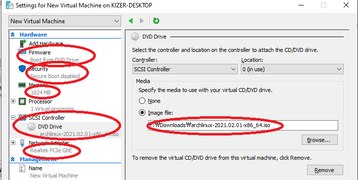
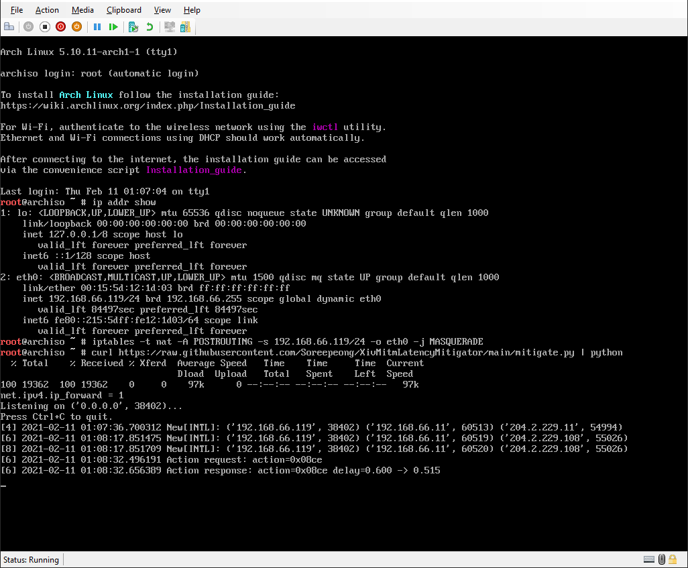

# XivMitmLatencyMitigator
Double weave for everyone, including PC, Mac, and PS4 users. No more being forced to single weaving because you are physically far away from game servers.

If you're running a custom VPN server on linux, just run the script as root, and you're good to go.

If you're running Windows, you can use [XivAlexander addon](https://github.com/Soreepeong/XivAlexander) instead. Do **not** stack both solutions. 

## How to use
1. If you have a linux machine running in same network, skip to 5.
2. If you have a virtualization solution installed regardless of host operating system, add an empty virtual machine with only DVD Drive enabled without hard drive, mount linux installation ISO into VM, power on, and then skip to 5.
3. For Windows: install Hyper-V, using `Hyper-V-Enabler.bat`.
   1. Open `Hyper-V Manager`. You can find this by typing so in Start Menu.
   2. Open `Virtual Switch Manager` on the menu at right.
      * 
   3. Add an `External` Virtual Switch.
      * 
   4. Select the adapter connected to the network which the machine you're going to play game from is in, then press OK.
      * 
4. Create a new virtual machine.
   1. Open `New Virtual Machine Wizard` with `New > Virtual Machine`.
      * 
   2. Pick `Generation 2` in `Specify Generation`.
      * 
   3. Write `256MB` or above into `Startup Memory` in `Assign Memory`.
   4. Pick the new adapter you've set up from 3-4 in `Connection` in `Configure Networking`.
   5. Pick `Attach a virtual hard disk later` in `Connect Virtual Hard Disk`.
   6. Using default choices for everything else, finish the wizard.
   7. Open `Settings` at right bottom panel of `Hyper-V Manager`.
      * 
   8. Go to `SCSI Controller` at the left panel, and add a `DVD Drive`.
   9. Go to `DVD Drive` at the left panel, pick `Image file:`, click on `Browse`, and select a linux distribution of your choice. If you do not have one downloaded, download [Arch Linux here](https://archlinux.org/download/).
   10. Go to `Security`, and turn off `Enable Secure Boot`.
   11. Go to `Firmware`, select `DVD Drive`, and press `Move Up`.
   * 
   10. Press `OK`.
   11. Press `Connect...` at the right bottom panel, and then power on the virtual machine.
5. Run `ip addr show` to figure out your virtual machine's IP address. It should result in something like the following:
   ```
   1: lo: <LOOPBACK,UP,LOWER_UP> mtu 65536 qdisc noqueue state UNKNOWN group default qlen 1000
       link/loopback 00:00:00:00:00:00 brd 00:00:00:00:00:00
       inet 127.0.0.1/8 scope host lo
          valid_lft forever preferred_lft forever
       inet6 ::1/128 scope host
          valid_lft forever preferred_lft forever
   2: eth0: <BROADCAST,MULTICAST,UP,LOWER_UP> mtu 1500 qdisc mq state UP group default qlen 1000
       link/ether 00:15:5d:12:1d:00 brd ff:ff:ff:ff:ff:ff
       inet 192.168.0.5/24 brd 192.168.0.255 scope global eth0
          valid_lft forever preferred_lft forever
       inet6 fe80::215:5dff:fe12:1d00/64 scope link
          valid_lft forever preferred_lft forever
   ```
6. Run `iptables -t nat -A POSTROUTING -s <local_ip> -o <device_name> -j MASQUERADE`, replacing:
   * `<device_name>` with the equivalent of `eth0` on above output.
   * `<local_ip>` with the equivalent of `192.168.0.5/24` on above output.
7. Run `curl https://raw.githubusercontent.com/Soreepeong/XivMitmLatencyMitigator/main/mitigate.py | python`
8. Configure your gaming device to use the virtual machine to route game traffic, replacing `<vm_ip>` with the equivalent of `192.168.0.5` on above output.
   * **Windows**: Run a `Command Prompt` as Administrator, and then run the following.
     ```
     route add 204.2.229.0 mask 255.255.255.0 <vm_ip>
     route add 124.150.157.0 mask 255.255.255.0 <vm_ip>
     route add 183.111.189.0 mask 255.255.255.0 <vm_ip>
     route add 195.82.50.0 mask 255.255.255.0 <vm_ip>
     ```
   * **Mac**: Run a `Terminal`, and the run the following.
     ```
     sudo route -n add -net 204.2.229.0/24 <vm_ip>
     sudo route -n add -net 124.150.157.0/24 <vm_ip>
     sudo route -n add -net 183.111.189.0/24 <vm_ip>
     sudo route -n add -net 195.82.50.0/24 <vm_ip>
     ```
   * **PS4**: Set up Static IP ([Guide](https://www.linksys.com/gb/support-article?articleNum=216429)), but use `<vm_ip>` instead for `Default Gateway`.
9. Run the game and see things get printed in the virtual machine, and if it does, it's working.
   * 
10. When you're done, you can force quit the virtual machine without "safe" procedures.

## License
Apache License 2.0
